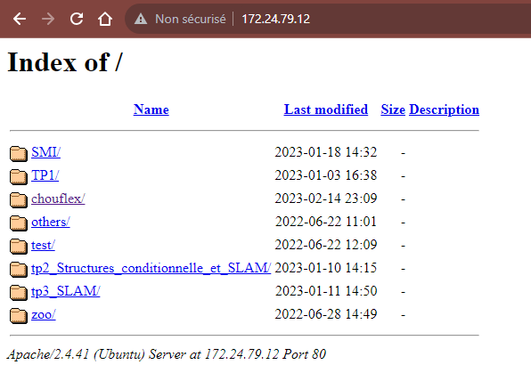
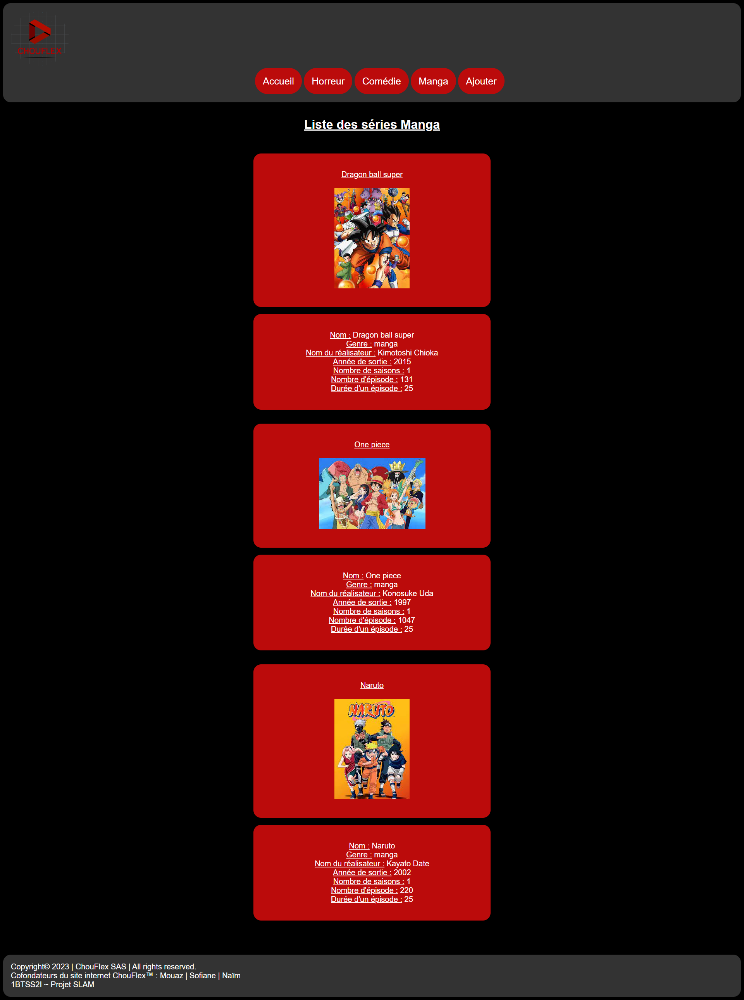

# Projet 2 - 1ère année de BTS - Site Web ~ Mouaz MOHAMED, Sofiane BOUHOURIA & Naïm Aïssioui
Notre projet est un site Web développé en HTML, CSS et PHP, inspiré de Netflix™, permettant de consulter (pour l'utilisateur), d'ajouter, de modifier et de supprimer des séries (pour l'administrateur) dans le catalogue à l'aide d'une base de données développée en SQL qui est relié au site Web grâce au PHP et avec le pilote MySQLi. 

---

## Diagramme des cas d'utilisation (User Case Diagram) de notre site Web dynamique


---

## Base de données
```plantuml
class Serie{
    nom: VARCHAR(50)
    genre: VARCHAR(50)
    realiateur: VARCHAR(50)
    annee: INT
    saison: INT
    episode: INT
    duree: INT
    img: VARCHAR(100)
}

class Connexion{
    id: VARCHAR(20) NOT NULL
    passwd: VARCHAR(20)
    PRIMARY KEY(id)
}
```

---

```sql
DROP DATABASE IF EXISTS chouflex;
CREATE DATABASE chouflex DEFAULT CHARACTER SET utf8 COLLATE utf8_swedish_ci;
use chouflex ;

CREATE TABLE serie(
nom VARCHAR(50),
genre VARCHAR(50),
realisateur VARCHAR(100),
annee INT,
saison INT,
episode INT,
duree INT,
img VARCHAR(100)
) ENGINE=Innodb;

CREATE TABLE connexion(
id VARCHAR(20) NOT NULL ,
passwd VARCHAR(20) ,
PRIMARY KEY(id)
) ENGINE=Innodb;
```

---

## Accéder à notre site Web via notre navigateur internet local
Nous avons installé une machine virtuelle tournant sous Debian OS (Linux) sur l'application de virtualisation Microsoft™ Hyper-V. Dans cette VM, nous avons tout d'abord vérifié que notre ordinateur local et la VM puissent se communiquer entre-eux en faisant des tests de ping et donc en vérifiant qu'ils sont sur le même réseau. Par la suite, nous avons installé le serveur Web Apache permettant d'accéder depuis notre navigateur web local aux données de la VM, donc notre site Web pour faciliter la visualisation des modifications liées au site Web.
Donc nous pouvons voir que nous pouvons accéder aux données de la VM sur notre navigateur web local.<br>


---

## Connexion entre la VM et Visual Studio Code via SSH
Sur Microsoft™ Visual Studio Code, nous avons installé l'extension <strong>Remote SSH</strong> de Microsoft™ permettant de nous connecter sur la VM et d'accéder aux données directement sur notre ordinateur local et d'utiliser le terminal sur Visual Studio Code afin de faire du scripting en Bash (Bourne-Again Shell) pour la base de données MariaDB que nous avons installé sur la VM.


---

## Accueil de notre site web
Voici l'accueil de notre site Web.<br>
<br>
Nous pouvons y retrouver les bandes d'annonces des séries de type Horreur, Comédie et Manga, ainsi nous pouvons se rendre dans les différents onglets grâce aux boutons.

---

## Page Horreur, Comédie et Manga
Voici les pages Horreur, Comédie et Manga, où la structure sont strictement identiques dans les trois pages. Il n'y a que le contenu qui change comme les titres des séries, les images, le genre, etc., de chaque série.<br>
<br>
<br>
<br>
Lorsque nous survolons la souris dans les onglets du site, il y a un changement de couleur, donc une transition de 0,4s. Dans tout le site Web, il y a beaucoup de transition de couleur, que ce soit dans les onglets, les boutons, les champs de saisie, les listes, etc.<br>

---

## Page de connexion (Ajouter)
Voici la page de Connexion de notre site Web.<br>
<br>
Cette page nous permet tout d'abord de nous connecter en tant qu'administrateur. Pour la vérification, lorsque nous appuyons sur Connexion, cela envoie une requête SQL à notre base de données pour vérifier si l'identifiant et le mot de passe correspondent à ceux enregistrés dans notre base de données. Si cela est vraie, alors nous allons atterir sur la page pour ajoiter des séries, sinon, la connexion sera échouée.<br>

```php
<?php
$connexion = new mysqli("localhost", "nom_de_la_VM", "mot_de_passe_de_la_VM$", "nom_de_la_bdd")
or die("connexion impossible");

$id=$_POST['id'];
$mdp=$_POST['passwd'];
$Requete1="Select * from connexion where id='$id' and passwd='$mdp'";
$Resultat1=$connexion->query($Requete1)
            or die("impossible d'executer la requête".$connexion->error);

if($Resultat1->num_rows >=1)
{
    header("location:connected.html");//redirection vers la page connected.html si la connexion est autorisé
}
else
{
    header("location:notConnected.html");//redirection vers la page notconnected.html si la connexion n'a pas pu aboutir
}
?>
```

<br>

<br>
Nous pouvons voir ici que la connexion a marché. Nous devons donc cliquer sur les émojis afin d'accéder à la page Ajouter.

---

## Page d'ajout de série non existant
Voici la page Ajouter de notre site Web.<br>
<br>
Nous pouvons ajouter une série de type Horreur, Comédie ou Manga dans notre base de données, en précisant le nom, le genre, le réalisateur, l'année de sortie, le nombre de saisons, le nombre d'épisode et la durée d'un épisode et l'afficher dans les pages Horreur, Comédie ou Manga.<br>
Lorsque la série a été ajoutée, cette page s'affiche. <br>
<br>
Nous pouvons également le voir dans notre base de données. <br>
<br>
```php
<?php
$connexion = new mysqli("localhost", "nom_de_la_VM", "mot_de_passe_de_la_VM$", "nom_de_la_bdd")
or die("connexion impossible");

$nom=$_POST['nom'];
$gen=$_POST['gen'];
$rea=$_POST['rea'];
$ann=$_POST['ann'];
$sai=$_POST['sai'];
$epi=$_POST['epi'];
$dur=$_POST['dur'];
$img="null";

$Requete1="INSERT INTO serie(nom, genre, realisateur, annee, saison, episode, duree, img) values ('$nom', '$gen', '$rea', '$ann', '$sai', '$epi', '$dur', '$img');";
$Resultat1=$connexion->query($Requete1)
            or die("Impossible d'executer la requête".$connexion->error);

if($nom && $gen && $rea && $ann && $sai && $epi && $dur == $Resultat1)
{
   header("location:ajouter_success.html");
}
else
{
   header("location:ajouter_fail.html");
}
?>
```

<br>

---

## Page de modification de série existant
Voici la page Modifier de notre site Web.<br>
<br>
Nous devons juste entrer le nom de la série existant (dans notre base de données) à modifier et par la suite modifier toutes les informations à propos de cette série. Cette page est accessible depuis la page Ajouter en cliquant sur Modifier.<br>
<br>
Lorsque la série a été modifiée, cette page s'affiche. <br>
<br>
```php
<?php
$connexion = new mysqli("localhost", "nom_de_la_VM", "mot_de_passe_de_la_VM$", "nom_de_la_bdd")
or die("connexion impossible");

$nom=$_POST['nom'];
$gen=$_POST['gen'];
$rea=$_POST['rea'];
$ann=$_POST['ann'];
$sai=$_POST['sai'];
$epi=$_POST['epi'];
$img="null";

$Requete1="UPDATE serie SET nom = $nom, genre = $gen, realisateur = $rea, annee = $ann, saison = $sai, episode = $epi, duree = $dur, img = $img; WHERE nom = $nom;";
$Resultat1=$connexion->query($Requete1)
            or die("Impossible d'executer la requête".$connexion->error);

if($nom == $Requete1)
{
    header("location:mod_success.html");
}
else
{
    header("location:mod_fail.html");
}
?>
```

---

## Page de supression de série existant
Voici la page Supprimer de note site Web.<br>
<br>
Il suffit juste d'entrer le nom de la série existant (dans notre base de données) à supprimer et le tour est joué. Cette page est accessible depuis la page Ajouter en cliquant sur Supprimer.<br>
<br>
Lorsque la série a été supprimée, cette page s'affiche.<br>

```php
<?php
$connexion = new mysqli("localhost", "nom_de_la_VM", "mot_de_passe_de_la_VM$", "nom_de_la_bdd")
or die("connexion impossible");

$nom=$_POST['nom'];

$Requete1="Delete from serie where nom='$nom'";
$Resultat1=$connexion->query($Requete1)
            or die("Impossible d'executer la requête".$connexion->error);

if($nom == $Resultat1)
{
    header("location:supp_success.html");
}
else
{
    header("location:supp_fail.html");
}
?>
```